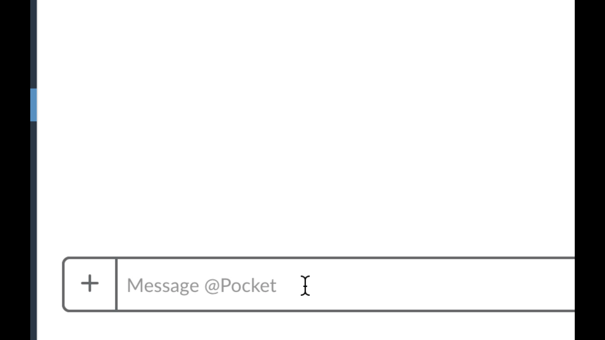

# SLACK CLAPBACK

  ADD👏🏾SOME👏🏾SASS👏🏾TO👏🏾YOUR👏🏾SENTENCE!👏🏾
  

## Reason behind this app

Using [Slack](https://slack.com/)? Enjoy a good [clapback](https://www.urbandictionary.com/define.php?term=clapback)? Then this application is a must!

I found myself always typing

`I👏🏾GOT👏🏾YOUR👏🏾BACK!👏🏾` in Slack.  Now granted, Slack makes it easy to add emojis, but I wanted to be more productive 😉

Using the `/clapback` [slash command](https://api.slack.com/slash-commands), users in all channels can have the words in their sentence(s) transformed to automatically be more sassy!

Example:

---

## Usage

Install the app by clicking this button:

Common phrases to try:

> Always be building!

> You pick lunch

> I'm not merging until you fix your commits!

> Per my last email...

## Contributing

Feel free to file an issue for any features you'd like to see, and of course...

### PR's 👏🏾 ARE 👏🏾 WELCOME!👏🏾